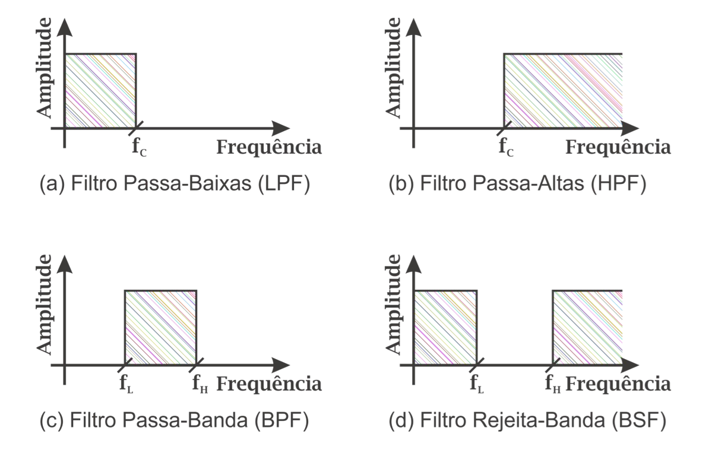
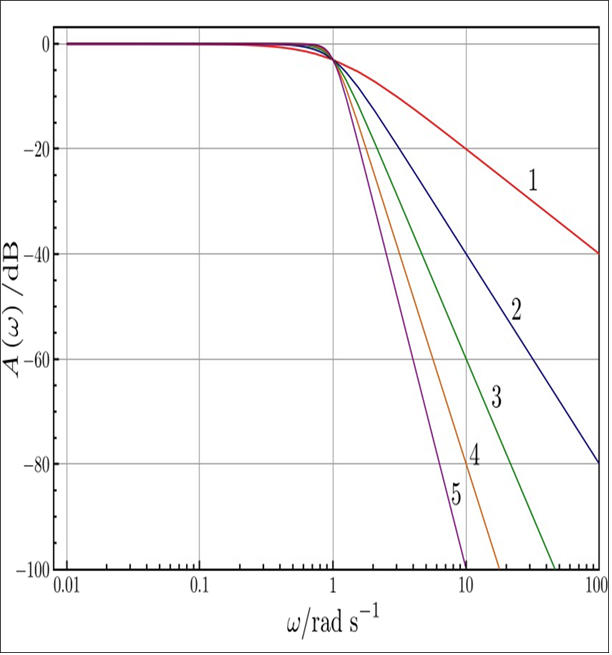
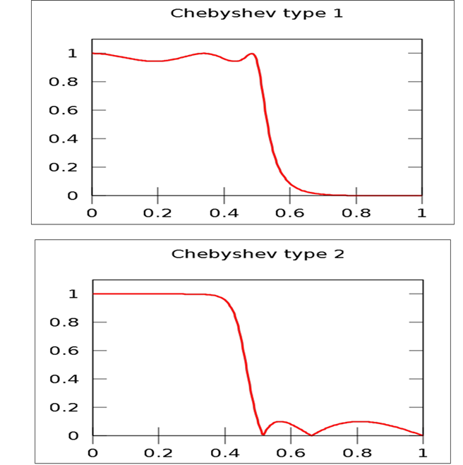
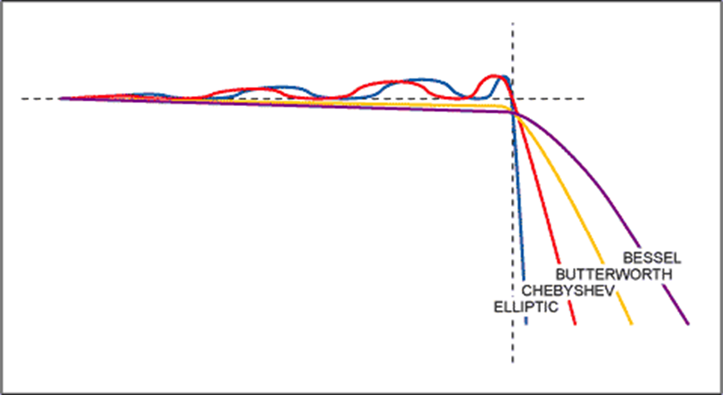
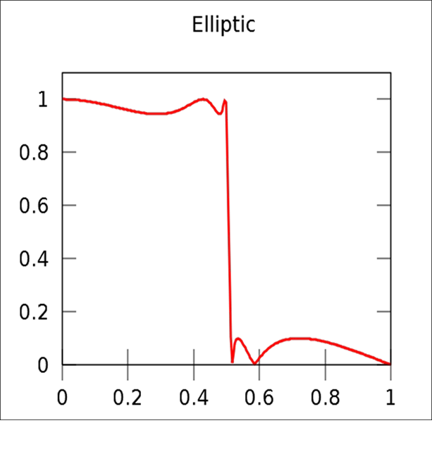

# EININDI - Filtros Analógicos  
**Um guia técnico sobre princípios, classificação, projeto e aplicações**

---

## Sumário

1.  [Introdução](#introdução)
2.  [Classificação dos Filtros Analógicos](#classificação-dos-filtros-analógicos)
    *   [Por Tecnologia](#1-por-tecnologia)
    *   [Por Resposta em Frequência](#2-por-resposta-em-frequência)
3.  [Princípio de Funcionamento](#princípio-de-funcionamento)
4.  [Projeto de Filtros Analógicos](#projeto-de-filtros-analógicos)
    *   [Tipos de Resposta](#tipos-de-resposta)
        *   [Butterworth](#butterworth)
        *   [Chebyshev](#chebyshev)
        *   [Bessel](#bessel)
        *   [Elíptico (Cauer)](#elíptico-cauer)
5.  [Aplicações](#aplicações)
6.  [Referências](#referências)

---

## Introdução

Filtros analógicos são circuitos eletrônicos que processam sinais contínuos para atenuar ou destacar componentes específicos de frequência. Utilizados em áreas como telecomunicações, áudio e instrumentação, eles são implementados com componentes passivos (resistores, capacitores, indutores) ou ativos (amplificadores operacionais). Este documento detalha sua classificação, funcionamento, metodologias de projeto (incluindo Butterworth, Chebyshev, Bessel e Elíptico) e aplicações práticas.

---

## Classificação dos Filtros Analógicos

### 1. Por Tecnologia

*   **Filtros Passivos**:  
    Compostos por resistores, capacitores e indutores. Não requerem fonte de energia externa e são ideais para aplicações de baixa frequência e alta potência.
    Exemplo: Filtro RC passa-baixa.
*   **Filtros Ativos**:  
    Incluem amplificadores operacionais ou transistores, permitindo maior controle do ganho, impedância e resposta em frequências mais altas. Requerem alimentação externa.
    Exemplo: Filtro Sallen-Key.

### 2. Por Resposta em Frequência

| Tipo                  | Função                                                                                           | Aplicações Típicas                                                         |
| :-------------------- | :----------------------------------------------------------------------------------------------- | :------------------------------------------------------------------------- |
| **Passa-Baixa (LPF)** | Permite frequências abaixo da frequência de corte ($f_c$).                                    | Redução de ruído em sistemas de áudio, suavização de sinais.               |
| **Passa-Alta (HPF)**  | Permite frequências acima de $f_c$.                                                           | Eliminação de *DC offset*, acoplamento AC.                               |
| **Passa-Banda (BPF)** | Permite uma faixa específica entre duas frequências de corte ($f_{c1}$ e $f_{c2}$).         | Rádio FM, equalizadores paramétricos.                                     |
| **Rejeita-Banda (BEF)** | Bloqueia uma faixa específica de frequências. Também conhecido como *notch filter*.             | Eliminação de interferência (ex: 60Hz da rede elétrica).                 |
| **Passa-Tudo (APF)**  | Mantém a amplitude do sinal, mas altera sua fase. Usado para correção de fase ou atraso de sinal. | Correção de fase em sistemas de comunicação, emula atrasos em processamento. |

---

## Princípio de Funcionamento

Filtros analógicos operam modificando a relação entre tensão e corrente em função da frequência:

*   **Filtros Passivos**: Usam combinações de impedâncias (ex.: $$Z = R + \frac{1}{j\omega C}$$) para criar atenuação seletiva. A energia é dissipada (em resistores) ou armazenada (em capacitores e indutores).
*   **Filtros Ativos**: Combinam componentes passivos com amplificadores para ajustar ganho e impedância. Permitem maior flexibilidade no projeto, incluindo ganho de sinal e impedâncias de entrada/saída controladas.

A função de transferência $$H(s)$$ de um filtro é crítica para definir seu comportamento.

---

## Projeto de Filtros Analógicos

### Tipos de Resposta

#### Butterworth

*   **Características**:
    *   Banda passante plana (sem ondulações/ripple).
    *   Atenuação gradual: -6n dB/oitava (n = ordem do filtro).
    *   Boa resposta de fase, com menor distorção de sinal.
*   **Função de Transferência** (2ª ordem):
    $$
    H(s) = \frac{\omega_c^2}{s^2 + \sqrt{2}\omega_c s + \omega_c^2}
    $$
*   **Aplicações**: Sistemas de áudio de alta fidelidade, instrumentação, onde a precisão na banda passante é fundamental. 

#### Chebyshev

*   **Características**:
    *   Ondulações (ripple) controladas na banda passante (Tipo I) ou banda de rejeição (Tipo II).
    *   Transição abrupta entre bandas (maior seletividade).
    *   Maior distorção de fase em comparação com Butterworth.
*   **Função de Transferência** (Tipo I):
    $$
    |H(\omega)|^2 = \frac{1}{1 + \epsilon^2 T_n^2(\omega/\omega_c)}
    $$
    onde $$T_n$$ é o polinômio de Chebyshev e $$\epsilon$$ define a amplitude do ripple.
*   **Aplicações**: Telecomunicações, processamento de sinais, onde a seletividade é mais importante que a fidelidade na banda passante. 

#### Bessel

*   **Características**:
    *   Resposta de fase linear na banda passante, ideal para preservar a forma de onda dos sinais (mínima distorção de fase).
    *   Atenuação mais gradual do que Butterworth ou Chebyshev.
    *   Retardo de grupo constante na banda passante.
*   **Função de Transferência**: Os polos são dispostos de forma a maximizar a linearidade da fase. Não há uma forma simples para a função de transferência geral.
*   **Aplicações**: Sistemas de comunicação de dados, processamento de vídeo, onde a integridade do sinal no domínio do tempo é crucial. 

#### Elíptico (Cauer)

*   **Características**:
    *   Ondulações tanto na banda passante quanto na banda de rejeição.
    *   Transição mais rápida (maior seletividade) entre a banda passante e a banda de rejeição em comparação com os outros tipos.
    *   Maior complexidade de projeto e implementação.
*   **Função de Transferência**: Envolve funções elípticas de Jacobi.
*   **Aplicações**: Aplicações que exigem a maior seletividade possível, como sistemas de análise espectral de alta precisão e processamento de sinais de rádio. 

### Comparação de Respostas em Frequência

\[Imagem ou gráfico comparando as respostas de frequência dos filtros Butterworth, Chebyshev, Bessel e Elíptico, mostrando as diferenças em ripple, seletividade e resposta de fase]

### Etapas de Projeto

1.  **Definição de Requisitos**:
    *   Especificar as frequências de corte, atenuação na banda de rejeição, ripple máximo (se aplicável) e tipo de resposta desejada (Butterworth, Chebyshev, Bessel, Elíptico).
2.  **Seleção da Topologia**:
    *   Filtros Passivos: Selecionar entre topologias LC (para alta qualidade e baixa perda) ou RC (para aplicações de baixa frequência).
    *   Filtros Ativos: Escolher entre topologias como Sallen-Key (para filtros de 2ª ordem), Multiple Feedback (MFB) ou outras configurações baseadas em amplificadores operacionais.
3.  **Cálculo dos Componentes**:
    *   Utilizar tabelas de filtros normalizados, software de projeto de filtros ou cálculos manuais para determinar os valores dos componentes (resistores, capacitores, indutores) com base nas especificações do filtro.
4.  **Simulação e Otimização**:
    *   Simular o circuito do filtro em software como SPICE ou LTspice para verificar se a resposta em frequência atende aos requisitos. Otimizar os valores dos componentes, se necessário, para melhorar o desempenho do filtro.
5.  **Implementação e Teste**:
    *   Construir o circuito do filtro em uma placa de circuito impresso (PCB) ou protoboard. Testar o filtro com equipamentos de teste, como analisadores de espectro ou geradores de sinais, para verificar se ele atende às especificações.

---

## Aplicações

1.  **Telecomunicações**:
    *   Filtros Chebyshev ou Elípticos em transmissores e receptores de RF para selecionar canais e rejeitar interferências.
    *   Filtros Bessel para preservar a integridade dos sinais de dados em sistemas de comunicação digital.
2.  **Áudio**:
    *   Filtros Butterworth em equalizadores gráficos e crossovers de áudio para suavizar a resposta em frequência e evitar distorções de fase.
    *   Filtros passa-baixa para eliminar ruídos de alta frequência em sistemas de gravação.
3.  **Instrumentação Médica**:
    *   Filtros para remover ruídos e artefatos de sinais de ECG e EEG.
    *   Filtros passa-alta para remover o *DC offset* e a derivação da linha de base em sinais biomédicos.
4.  **Controle e Automação**:
    *   Filtros para suavizar sinais de sensores e atuadores em sistemas de controle.
    *   Filtros para eliminar ruídos em sistemas de aquisição de dados.

---

## Referências

*   \[Links para recursos adicionais sobre projeto de filtros analógicos, como livros, artigos técnicos, notas de aplicação e software de simulação.]